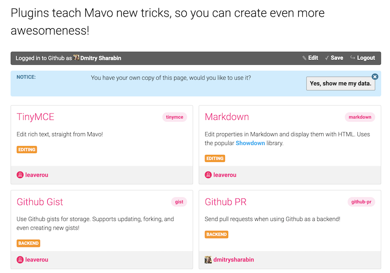
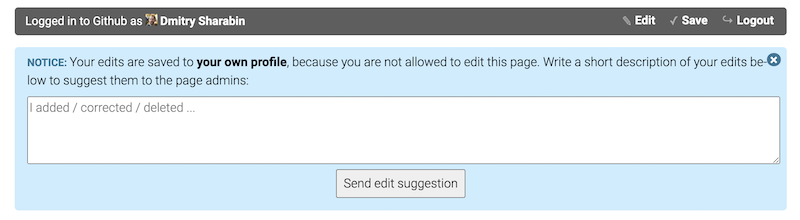
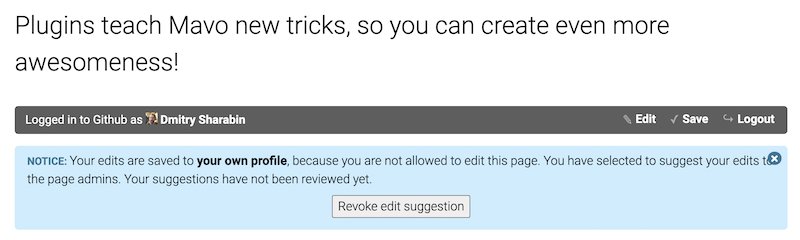
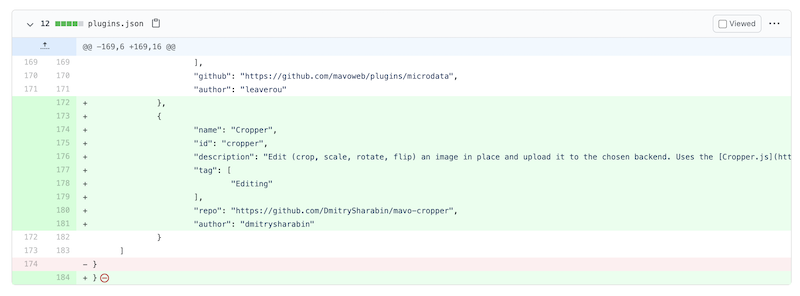

# GitHub Pull Requests

This plugin allows you to send pull requests when using Github as a backend.

## Basics

If the logged-in user **does not have commit permissions** (i.e., is neither the creator of the repo nor added as a collaborator), the app data will be stored in their own profile, and they will be prompted to send an “edit suggestion” to the original owner of the data.

Editing suggestions are sent as [pull requests](https://help.github.com/articles/about-pull-requests/), with a link to view the new data in the Mavo app (by using the [`storage` URL parameter](https://mavo.io/docs/storage#url-params)).

Currently, reviewing the changes between the new and old data (i.e., the *diff*) requires the ability to read JSON (unless you’re using a different format for your data). Future Mavo versions and also new versions of this plugin may introduce a graphical way for this as well.

## Caveats

Image uploads can introduce some bizarre issues when using Github “edit suggestions” (pull requests). Since image URLs are stored in the data and don't change once you merge the pull request, they will always point to the fork that created the edit suggestion. Even worse, if the repo uses Github Pages or you use a custom URL via `mv-upload-url`, the URLs will be broken until the pull request is merged, and the user won’t know what they did wrong. Given that Mavo is client-side and cannot execute code upon merging the pull request, we are still unsure how to address this. You can add your thoughts to [issue #538](https://github.com/mavoweb/mavo/issues/538).

## Customizing Text & Localization

The plugin provides a set of phrases you can use, change, and localize. Here is the list of `id`s of these phrases and their default values:

| id                                      | Default Value                                                                                                                           |
| --------------------------------------- | --------------------------------------------------------------------------------------------------------------------------------------- |
| `gh-edit-suggestion-saved-in-profile`   | Your edits are saved to <a href=\"{previewURL}\" target=\"_blank\">your own profile</a>, because you are not allowed to edit this page. |
| `gh-edit-suggestion-instructions`       | Write a short description of your edits below to suggest them to the page admins:                                                       |
| `gh-edit-suggestion-notreviewed`        | You have selected to suggest your edits to the page admins. Your suggestions have not been reviewed yet.                                |
| `gh-edit-suggestion-send`               | Send edit suggestion                                                                                                                    |
| `gh-edit-suggestion-revoke`             | Revoke edit suggestion                                                                                                                  |
| `gh-edit-suggestion-reason-placeholder` | I added / corrected / deleted ...                                                                                                       |
| `gh-edit-suggestion-cancelled`          | Edit suggestion cancelled successfully!                                                                                                 |
| `gh-edit-suggestion-title`              | Suggested edits to data                                                                                                                 |
| `gh-edit-suggestion-body`               | Hello there! I used Mavo to suggest the following edits:{description} Preview my changes here: {previewURL}                             |
| `gh-edit-suggestion-sent`               | Edit suggestion sent successfully!                                                                                                      |
